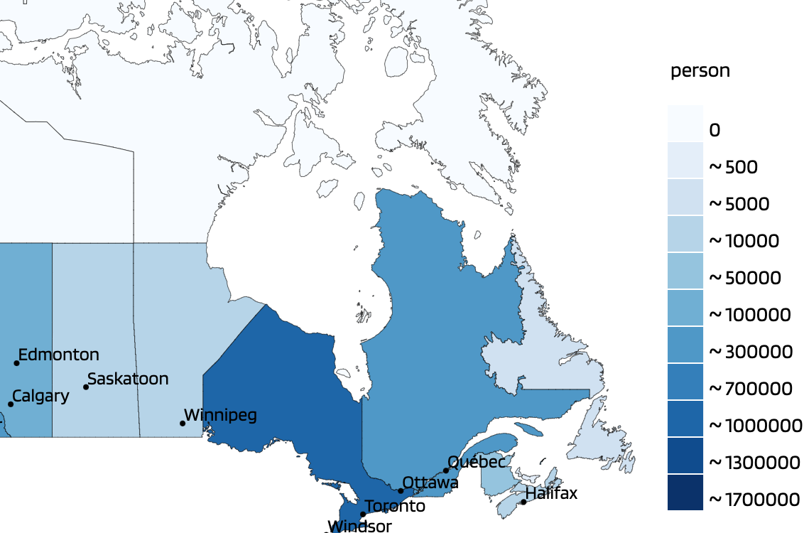
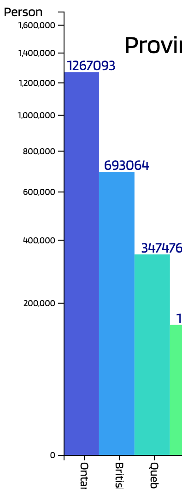

# Monthly Canadian Province Visited from Overseas in 2000 - 2019
-----
###  [live site](https://devneolee.github.io/DataVisualization4/): http://devneolee.github.io/DataVisualization4/
-----
## Technology
- d3.js 
- JavaScript
- HTML
- CSS
- CSV, JSON
- Webpack
-----
## Motivation
This project aims to achieve meaningul graphical information on a page intuitively from large volume of complicated data sets using javascript tool most effectively on web development environment.
> Data Interpretation is the process of making sense out of a collection of data > that has been processed. This collection may be present in various forms like > bar graphs, line charts and tabular forms and other similar forms and hence 
> needs an interpretation of some kind.
-----
## Questions could be answered from the Application 
-----
1. Where is the Most Popular Canadian Province to Travel from Oversea Visitors Over Last 20 Years?

1. Is There Any Popularity Trend Changes Over Time?

1. Are Total Travelers Increasing or Decreasing On Each Province and Canada?

1. Which Month or Seasons Are Busier Than the Others?

1. Which Month or Month is the Most Visited Over the Time?

1. Which City is the Most Visited, on Which Month ,and in Which Year?

1. Specific graphical chart and method have choosed to maximize the representation of specific meaning from the data set just like as good data scientist does on their works.

1. Knowedge to analize complicated big data sets and representing interactively on Web Application is facinating process.
-----
## Features:
1. scale to represent the same data to different graphical respresentation.
>Scales are a convenient abstraction for a fundamental task in >visualization: mapping a dimension of abstract data to a visual 
>representation.

    - linear
    - square
    - threshold

## 1. Threshold Scale


```javascript
const visitorFormat = [0, 500, 5000, 10000, 50000, 100000, 300000, 700000, 1000000, 1300000, 1700000]; //custom visitors amounts

const colorScale = d3.scaleThreshold()//specific colors for specific group of visitor amount
    .domain(visitorFormat)
    .range(["#ffffff", "#f7fbff", "#e3eef9", "#cfe1f2", "#b5d4e9", "#93c3df", "#6daed5", "#4b97c9", "#2f7ebc", "#1864aa", "#0a4a90", "#08306b"]);
```

```javascript
d3.selectAll('.path')
    .data(dataSorted)
    .style("fill", function (d) { return colorScale(parseInt(d.VALUE)) })
```
The function is shown below:
 ## 2.Square Scale

```javascript
const yScale = d3.scaleSqrt()
    .domain([0, 1700000]) // record high number of visitors, hard code here if there is new high! 
    .range([0, height]);
const yAxisScale = d3.scaleSqrt()
    .domain([1700000, 0]) // record high number of visitors, hard code here if there is new high!
    .range([0, height]);

```

## 3. Linear Scale

```javascript
 const xScale = d3.scaleLinear()
        .rangeRound([0, width])
        .domain([0, data.length]);
```

## Tooltip d3 text with mouse action listen


``` javascript
//create tooptip element
const mapTooltip = d3.select("body").append("div")
    .attr("class", "tooltip")
    .style("opacity", 0);

//listen mouseover event
function onMouseOver(d, i) {
    mapTooltip.transition()
        .duration(0)
        .style("opacity", 0.9);
    mapTooltip.html(d.GEO + " on " + d.REF_DATE + "<br/>" + "Tourists from Overseas: " + d.VALUE + " persons")
        .style("left", (d3.event.pageX - 100) + "px")
        .style("top", (d3.event.pageY - 120) + "px");
}

//listen mouseout event
function onMouseOut(d, i) {
    d3.selectAll('div.tooltip')
        .style('opacity', 0);
}
```

1. data sending to specifc chart functions
```javascript
       const monthlyData = [];
        for(let ele = 0; ele < data.length; ele ++ ) {
            if ((parseInt(data[ele]['REF_DATE'].slice(2, 4)) == year) &&
                (parseInt(data[ele]['REF_DATE'].slice(5, 7)) == month))
            {
                monthlyData.push(data[ele]);
            }
            if (monthlyData.length == 12 ) { break }
        }
 
    mapChart(monthlyData); //call map chart with unsorted data
  
    const sortedMonthlyData = [...monthlyData]; //copy unsorted data
    sortedMonthlyData.sort(function(b, a){ return parseInt(a.VALUE) - parseInt(b.VALUE)}); // sort data in order according to the value amount
    
    // calculate the total # of visitors to Canada on the month data
    const totalVisitor = sortedMonthlyData.reduce((a, b) => (a + parseInt(b.VALUE)), 0);

    //call charts drawing with sorted monthly data
    barChart(sortedMonthlyData);
    pieChart(sortedMonthlyData, totalVisitor);
```

1. city locating on the map and pointing out
 projection and longitude, latitude
```javascript
const city = canvas2.selectAll('.cityDots')
                .data(cities)
                .enter()
                .append('circle')
                .attr('class', 'cityDots')
                .attr('r', 2)
                .attr('cx', city =>{
                    const coords1 = projection([city.lng, city.lat]);
                    return coords1[0];
                    })
                .attr('cy', city => {
                    const coords2 = projection([city.lng, city.lat]);
                    return coords2[1];
                    });
```

## Future Features to Come

- Further Details on Each Canadian Cities
- Interconnected actions of different charts to each other
- Represent related data sets from different data set files 
- concurrently and give more insight and meaning of the data sets.
- Use other tools run concurrently with D3.
- Updating automatically with newly updated data sets from api sources.


Installation
Provide step by step series of examples and explanations about how to get a development env running.

API Reference
Depending on the size of the project, if it is small and simple enough the reference docs can be added to the README. For medium size to larger projects it is important to at least provide a link to where the API reference docs live.

Tests
Describe and show how to run the tests with code examples.

How to use?
If people like your project they’ll want to learn how they can use it. To do so include step by step guide to use your project.

Contribute
Let people know how they can contribute into your project. A contributing guideline will be a big plus.

Credits
Give proper credits. This could be a link to any repo which inspired you to build this project, any blogposts or links to people who contrbuted in this project.

## License ##
MIT © Justin K Lee