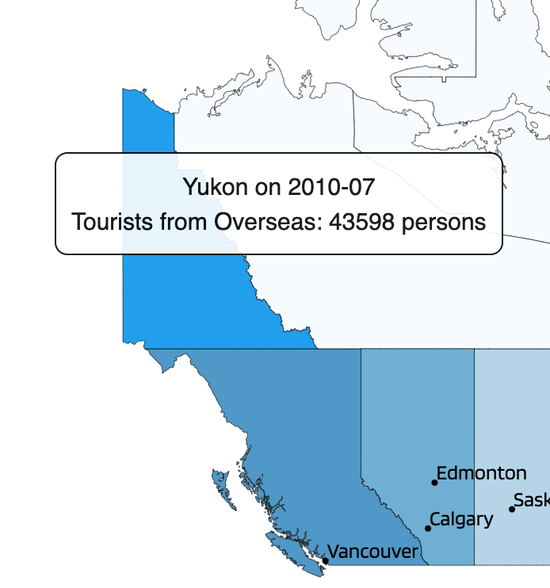

# <u>Canadian Province Visited from Overseas in 2000 - 2019</u>

### ** [live site](https://devneolee.github.io/DataVisualization4/): http://devneolee.github.io/DataVisualization4/**
-----
## **Technology**
- d3.js 
- JavaScript
- HTML
- CSS
- CSV, JSON
- Webpack
=====

(blockquote)
> hello there
> what a wonderful day!

## What the Application Can Show


1. Where is the Most Popular Canadian Province to Travel from Oversea Visitors Over Last 20 Years?

1. Is There Any Popularity Trend Changes Over Time?

1. Are Total Travelers Increasing or Decreasing On Each Province and Canada?

1. Which Month or Seasons Are Busier Than the Others?

1. Which Month or Month is the Most Visited Over the Time?

1. Which City is the Most Visited, on Which Month ,and in Which Year?

1. Specific graphical chart and method have choosed to maximize the representation of specific meaning from the data set just like as good data scientist does on their works.

1. Knowedge to analize complicated big data sets and representing interactively on Web Application is facinating process.


## Summary
This project aims to achieve meaningul graphical information on a page intuitively from large volume of complicated data sets using javascript tool most effectively on web development environment.

## Features:

1. scale to represent the same data to different graphical respresentation.

(blockquote)
>Scales are a convenient abstraction for a fundamental task in >visualization: mapping a dimension of abstract data to a visual 
>representation.

    1. linear
    1. square
    1. threshold

1. ## threshold


```javascript
 const visitorFormat = [0, 500, 5000, 10000, 50000, 100000, 300000, 700000, 1000000, 1300000, 1700000]; //custom visitors amounts

const colorScale = d3.scaleThreshold()//specific colors for specific group of visitor amount
    .domain(visitorFormat)
    .range(["#ffffff", "#f7fbff", "#e3eef9", "#cfe1f2", "#b5d4e9", "#93c3df", "#6daed5", "#4b97c9", "#2f7ebc", "#1864aa", "#0a4a90", "#08306b"]);
```

```javascript
d3.selectAll('.path')
    .data(dataSorted)
    .style("fill", function (d) { return colorScale(parseInt(d.VALUE)) })
```
The function is shown below:
 1. ## square

```javascript
const yScale = d3.scaleSqrt()
    .domain([0, 1700000]) // record high number of visitors, hard code here if there is new high! 
    .range([0, height]);
const yAxisScale = d3.scaleSqrt()
    .domain([1700000, 0]) // record high number of visitors, hard code here if there is new high!
    .range([0, height]);

```

1. ## linear

```javascript
 const xScale = d3.scaleLinear()
        .rangeRound([0, width])
        .domain([0, data.length]);
```

1. tooltip 




``` javascript
//create tooptip element
const mapTooltip = d3.select("body").append("div")
    .attr("class", "tooltip")
    .style("opacity", 0);

//listen mouseover event
function onMouseOver(d, i) {
    mapTooltip.transition()
        .duration(0)
        .style("opacity", 0.9);
    mapTooltip.html(d.GEO + " on " + d.REF_DATE + "<br/>" + "Tourists from Overseas: " + d.VALUE + " persons")
        .style("left", (d3.event.pageX - 100) + "px")
        .style("top", (d3.event.pageY - 120) + "px");
}

//listen mouseout event
function onMouseOut(d, i) {
    d3.selectAll('div.tooltip')
        .style('opacity', 0);
}
```

1. d3 text with mouse action listen

1. data sending to specifc chart functions

1. city locating on the map and pointing out
 projection and longitude, latitude

## ** Future Features to Come: **

- Further Details on Each Canadian Cities
- Interconnected actions of different charts to each other
- Represent related data sets from different data set files 
- concurrently and give more insight and meaning of the data sets.
- Use other tools run concurrently with D3.
- Updating automatically with newly updated data sets from api sources.
